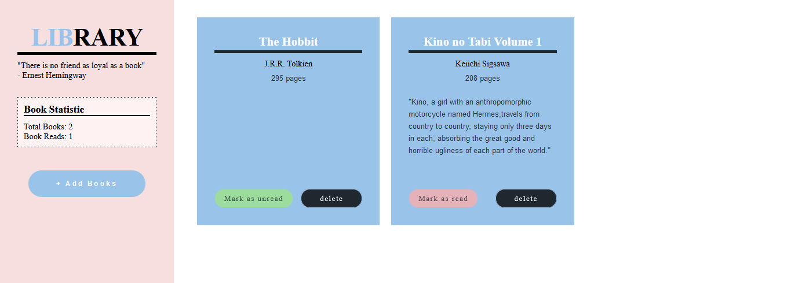

# Project: Library

Live preview [here](https://shiielty.github.io/library/).

---
In this project, I made a library app to store books using HTML, CSS, and JavaScript.  

I learn a lot about Object and Object Constructor from this project.  
At first, I had a hard time understanding the concept of object constructor, prototype, and prototypal inheritance.  But after finishing this project I have a better understanding of those concept.

